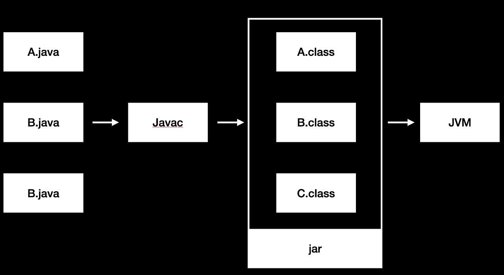
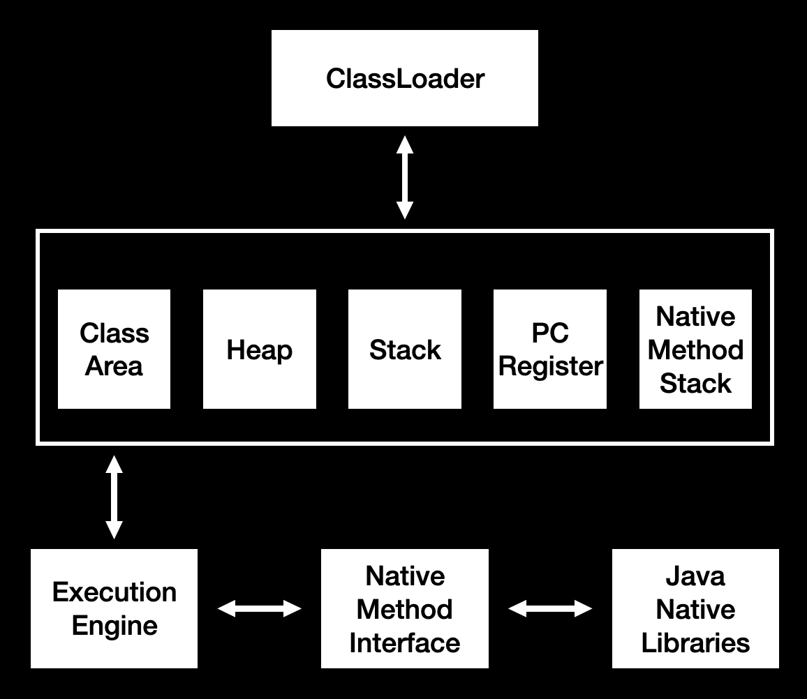

## 개요
자바는 '한 번 작성하면, 어디서나 실행할 수 있다'는 핵심 철학 및 가치가 있습니다. 

좀 더 자세히 들어가면 '한 번 작성하면 어느 JVM(Java Virtual Marchine)에서든 돌아갈 수 있다'로 이어진다고 생각합니다. 

즉 자바는 운영체제의 종속성을 가지지 않는다는 특징이 있는데, 이는 자바가 돌아가는 JVM이 그 종속성을 해결해주기 때문입니다. 운영체제 뿐만 아니라 어떤 환경이든 그곳에 맞는 JVM만 있다면 모든 자바 코드를 실행할 수 있는 것입니다.

여기서 말하는 JVM이 무엇인지, 세 가지 의미를 통해 알아보려고 합니다.

## JVM의 대표적인 세 가지 의미

JVM이란 단어는 대표적으로 세 가지가 의미로 사용됩니다.
- Runtime instance
- An implementation
- A Specification

 

> Runtime instance

첫 번째는 런타임 인스턴스입니다. 자바 프로그램을 실행하게 되면 JVM 실행 구현체가 생기게 되는데요 이것을 의미하는 것입니다.

이 인스턴스는 자바 바이트코드를 로드, 검증, 실행하고 런타임 실행환경을 제공하게 됩니다.

먼저 자바 바이트코드라는 것에 대해 자세히 알아보겠습니다. 실제로 JVM은 자바 뿐만 아니라 코틀린, 그루비, 스칼라와 같은 언어들의 실행환경으로 작동하는데요, 이는 모두 자바 바이트코드(class)를 실행한다는 공통점이 있습니다.

그림으로 표현하면 다음과 같습니다. 개발자는 .java 파일을 작성하고 Javac 컴파일러를 통해 .class 바이트코드로 컴파일을 수행합니다. 그리고 jar 방식으로 패키징을 수행하기도 하는데요, 이렇게 컴파일된 바이트코드를 JVM으로 전달하여 인스트럭션별로 런타임에 실행을 하게 되는 것입니다.

 

> A Spectification

다음으로 가지는 의미는 스펙입니다. 객체지향스럽게 저는 일종의 인터페이스 개념으로 이해를 하였습니다. 스펙을 만족하면 그것은 모두 JVM(구현체)라는 뜻입니다. 이는 중요한 의미를 가지는데 JVM은 프로그램, 가상머신, 나아가 컴퓨터도 될 수 있습니다. 그래서 JVM은 프로그램이다, 가상 머신이다 이런 전제는 틀린 것이라고 생각합니다. 이렇게 구현의 자율성을 제공하는 JVM의 철학은 프로그램 형태라는 효율적인 방식을 대중화시켰고, GC, JIT 컴파일러와 같은 현대 기술들의 적용을 가능하게 했습니다.

문서상의 JVM의 스펙은 매우 방대하지만 대표적으로 다음 그림과 같은 내용이 존재합니다.

ClassLoader에서 자바바이트코드를 로드하고, 검증하며, 상자 영역과 같이 메모리 관리 환경을 제공합니다.

그리고 Execution Engine에서는 인스트럭션을 실행하고 네이티브 메소드 호출이 필요한 경우 라이브러리와 연계해 이를 처리합니다.

JVM에 메모리 영역에는 5개의 요소가 존재하는 것을 확인하실 수 있는데요, Class Area(Method Area, Static Area)에서는 클래스 정보, 인스턴스의 공통적인 메소드 정보와 같은 전역적인 데이터를 관리합니다. Heap 영역에서는 동적 할당된 인스턴스의 정보를 관리합니다. Stact에서는 지역변수 등 스레드별로 관리해야 할 데이터를 관리하며, 스레드의 인스트럭션 실행 위치 정보는 PC Registe에 관리됩니다. 마지막으로 Native Method Stack에서는 Java가 아닌 기타 언어, 예를 들어 OS 관련 연계를 처리해야 하는 C언어 코드 호출과 같은 네이티브 메소드 호출에 필요한 변수 정보와 같은 부분을 관리합니다.

여기서 Heap 영역의 동적할당 데이터를 관리하는 GC, Execution Engine에서 런타임 최적화를 진행하는 JIT 컴파일러와 같은 부분이 빠져있는 것을 확인하실 수 있는데요, 이는 아까 언급한 것과 같이 JVM의 표준 스펙은 아니며 JVM 구현체에서 도입한 대표적인 기술로서 JVM 구현체의 발전에 기여한 기술입니다.

GC를 통해 개발자가 신경쓰지 않아도 자동적인 메모리 관리가 가능하게 되었고, JIT(Just In Time) 컴파일러는 .class 바이트 코드를 JVM 인터프리터에서 인스트럭션별로 처리하는 것에 대한 성능 저하와 같은 부분을 캐시 처리와 같이 최적화 해줌으로써 성능 개선에 크게 기여하였습니다.

 

> An Implementation

마지막으로 가지는 의미는 구현체입니다. Oracle OpenJDK와 같이 환경별로 수많은 구현체들이 존재하는데요, 당연히 이들은 공통적으로 JVM의 스펙을 만족합니다. 이들 덕분에 저희는 Java 프로그램을 작성하고, 배포를 진행할때 환경에 맞는 JVM 구현체를 설치하여 이를 실행할 수 있는 것입니다. 여기서 JDK, JRE를 마주치게 되는데요, JRE는 JVM 구현체와 자바 표준 API와 같은 런타임 환경을 제공합니다. 그리고 JDK는 JRE뿐만 아니라 javac 컴파일러, 디버거, javadoc과 같은 개발 도구들을 포함합니다.

이렇게 JVM의 세 가지 의미를 주제로 알아보았는데요, JVM부터 참 객체지향스럽고 이러한 철학으로 '작성된 Java 코드는 어떤 JVM에서든 돌아간다'라는 핵심 가치를 증명하였고 이로 인해 자바 커뮤니티가 발전하고 덕분에 수많은 학습자료를 통해 공부를 할 수 있다는 것은 정말 감사한 일인 것 같습니다.

## 참고 문헌
- https://www.javatpoint.com/jvm-java-virtual-machine
- https://www.infoworld.com/article/3272244/what-is-the-jvm-introducing-the-java-virtual-machine.html

